<pre align="center">
  
</pre>  

<h3 align="center">
  
</h3>

  

---

### 🛠️ Tech Stack & Tools

  

---

### 💬 Discord Status

  

---

### 🚏 Plan&Ride

A friend and I built **[Plan&Ride](https://par.karafa.net)** because checking a Slovak bus shouldn't take three websites. It shows live departures from any stop, plans connections and tracks where your bus is right now. It's free and open source.

---

### 📊 GitHub Statistics

  

